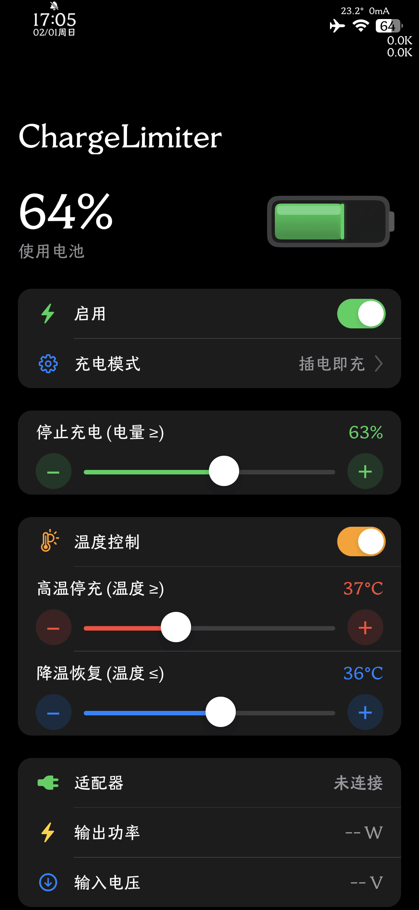
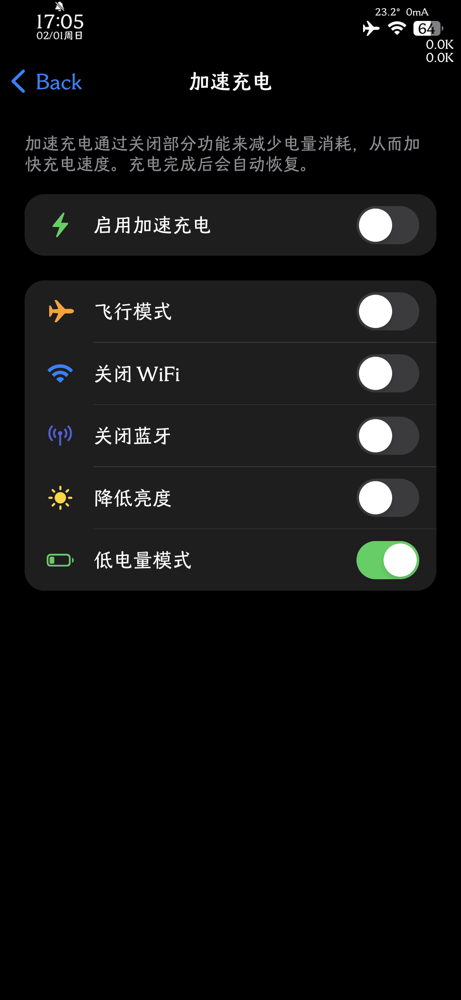
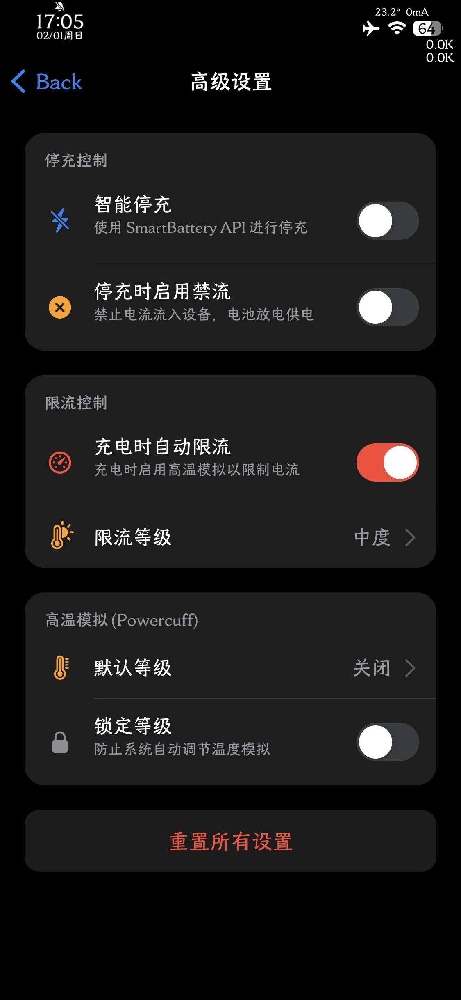

# ChargeLimiter

中文 · **[English](#introduction)**

ChargeLimiter（下文简称 CL）是面向 iPhone 的充电控制工具（macOS 上 AlDente 的替代品），用于减少设备长时间停留在高电量、高温和长期满充状态，尽量不影响日常使用。

> 它不是硬件级旁路充电。
>
> 当前实现仍是软件层策略控制：结合电量、温度、外部供电状态、系统优化充电状态和守护进程逻辑，决定何时停充、何时恢复充电、是否禁流/限流，以及何时临时协调系统优化充电。

<p align="center">
  
  
  
  
</p>

## 介绍

* CL 适用于长时间过充场景下的电池健康度保护：长期插电办公、整夜充电、充电时希望控制温度。
* 支持巨魔 TrollStore（`.tipa`）、有根越狱 rootful（`.deb`）、无根越狱 rootless（`.deb`）、roothide（`.deb`，原生构建）。最低系统要求 iOS 13.0；重点验证环境为 iOS 15–17。
* 本仓库是 [lich4/ChargeLimiter](https://github.com/lich4/ChargeLimiter) 的社区分支（fork），在上游 v1.7 系的基础上持续演进：原生 UIKit 界面、智能停充、插电保持、满充计划、限流原子配置、策略诊断、relaxin/roothide 原生适配等。版本历史见 [CHANGELOG.md](CHANGELOG.md)。
* CL 是开放式项目，欢迎提交代码与建议。CL 承诺永久免费且无广告；但因为使用 CL 导致系统或硬件方面的影响（或认为会有影响的），作者不负任何责任，用户使用 CL 即为默认同意本条款。如果你的软硬件环境不兼容，则不建议使用。

## 当前定位

ChargeLimiter 本质上是一个充电策略调度器，不是硬件电源路径改造器。它会根据你设定的规则和当前电池状态，决定：

- 是否允许继续充电
- 是否进入停充
- 是否进一步禁止电流流入设备（禁流）
- 是否通过模拟高温限制充电电流（限流）
- 是否临时协调系统优化充电
- 是否在满充计划窗口内暂时放开电量上限

## 功能总览

- 电量上限 / 下限控制，主页停充预设一键应用
- `智能停充`：停充时优先使用 `PredictiveChargingInhibit` 抑制充电，不生效时自动回退到传统停充路径
- `停止电量=100% 时交由系统控制`
- `停充时启用禁流`
- `插电保持`：围绕停充目标维持缓冲区间（类似 AlDente 的 Sailing Mode）
- 温度控制（高温停充 / 降温恢复）
- 系统优化充电协调与`永久停用系统优化充电`
- `满充计划`：每隔数天在指定时间暂时解除电量上限
- `限流等级`（原子配置）与`高温模拟 (Powercuff)`
- `加速充电`
- `策略诊断`、`停充控制探针`与守护进程修复
- `历史统计`与`策略事件时间线`
- 导出诊断摘要、事件时间线、真机长测校准模板
- 日志级别（标准 / 仅错误）、刷新频率、语言、深色模式
- URL Scheme（`cl://`）与本地 HTTP 接口，可配合快捷指令自动化

## 适合谁 / 不适合谁

适合你，如果你：

- 希望 iPhone 长期插电时，不要一路慢慢充到 100%
- 希望把设备长期保持在一个更低、更稳定的电量区间
- 经常边充边用，想更清楚地知道"现在到底为什么停充 / 限流 / 禁流"
- 愿意在"续航上限、温度、性能、充电速度"之间自己做取舍

不适合，如果：

- 电池或小板硬件既不支持停充也不支持禁流（见[电池兼容性测试](#电池兼容性测试)）
- 你的系统版本低于 iOS 13.0

## 使用前必看

* iPhone 8 及以上机型存在最多 120 秒的充电状态设定延迟，iPad 可能同样存在。
* 停充模式不会更新系统状态栏的充电标志（实际状态以 CL 内显示为准）；禁流模式会改变状态栏充电标志。
* CL 的设计思路是减少充电次数：不会一连上 USB 就自发充电，也不会无故自动恢复充电，充电/停充都有触发条件。
* 巨魔（TrollStore）环境下，任何原因导致的服务被杀（重启系统/重启用户空间/半越狱不稳定/iCloud 夜间同步/其他巨魔 App 冲突）都会使 CL 失效，表现为一夜充满。这并非软件 Bug；CL 提供尽力而为的保活能力（快捷指令 URL Scheme 拉起服务）。巨魔环境不稳定的用户建议使用越狱版本。
* 系统自带"优化电池充电"（Optimized Battery Charging）会与 CL 抢占充电控制权。CL 已内置协调能力：接管期间临时停用、退出后尝试恢复；你也可以在充电高级中`永久停用系统优化充电`。关闭 CL 后如需恢复系统优化充电，请在系统设置中手动重置该开关（先关后开）。
* 新电池请先激活再使用 CL，否则有几率出现硬件停充失效问题（见[品牌新电池激活](#品牌新电池激活)）。
* 停充过久会出现小板电量统计有误和硬件停充失效问题，建议一个月至少满充满放一次。
* DEB 版本可能因某些注入 `com.apple.UIKit` 的 tweak 导致启动卡屏，这并非 CL 的 Bug。这些 tweak 位于 `/Library/MobileSubstrate/DynamicLibraries`（有根）或 `/var/jb/Library/MobileSubstrate/DynamicLibraries`（无根）。

## 新用户学习资料

### 名词解释

* **停充（ChargeInhibit）**：禁止电流流入电池。此时电池不充电也不放电，电源直接为设备硬件供电。**应优先使用此模式。**
* **禁流（DisableInflow）**：禁止电流流入设备。此时电池处于放电状态、为设备供电。电池不支持停充时才使用此模式。
* **限流（LimitInflow）**：通过模拟高温的方式限制充电电流。充电电流过大导致电池异常发热时使用此模式。
* **插电保持（Hold）**：围绕"停止充电"目标维持一个缓冲区间，电量缓降到区间下边界后才补电回目标，模拟 AlDente 的 Sailing Mode。

### 电池兼容性测试

使用 CL 前请先确认电池兼容性，不支持请放弃使用：

1. **测试停充**：关闭 CL 全局开关，然后通过 HTTP 接口手动停充（`curl http://127.0.0.1:1230 -d '{"api":"set_charge_status","flag":false}' -H "content-type:application/json"`），若 120 秒内充电状态有变化则支持停充；若停充后仍有较大持续电池电流（≥5mA，以实际电量变化为准）则无法支持停充。
2. **测试智能停充**：打开`充电高级-智能停充`，其余同上。
3. **测试禁流**：关闭 CL 全局开关，通过 HTTP 接口手动禁流（`{"api":"set_inflow_status","flag":false}`），若 120 秒内状态有变化则支持禁流；若禁流后有较大持续电流（≥5mA）则无法支持。
4. 也可以在 App 内运行`充电高级-停充控制探针`：插电状态下自动尝试多种停充写法并恢复，用于确认 iOS 控制面是否真正生效。

注意：

* 少数电池/小板可能因温度升高、健康度过低或未激活导致"失控"（CL 无法控制）。低健康度电池若表现为重启后可控、一段时间后失控，也无法使用 CL。
* 若电池既不支持停充也不支持禁流，则永远不被 CL 支持。
* 使用过程中健康度以不正常方式下降时，请自行调整充电高级中的选项或停用 CL。

### 品牌新电池激活

电池保养官方文档：<https://www.apple.com.cn/batteries/maximizing-performance/>。电池激活是指新电池出厂后以正确方式排除虚电、激发全部锂离子活性。建议咨询电池卖家或厂商获取正确激活方式，否则可能导致 CL 无法正常工作。常见品牌（整理自上游，以厂商官方说明为准）：

* **诺希**：不管开始有多少电量，使用到手机关机，然后充电，充满之后再充半小时，循环 5~8 天（如已充电没关系，下次重复即可）。建议使用 5V1A 小电流充电器激活，慢充效果更佳。
* **Dseven**：用到 10% 左右再充电，不要用到关机，充到 100% 再多充 1-2 小时，循环 5-7 次。
* **德赛**：新电池先把电量耗尽再充满，第二次用到 10% 左右再充满，循环 5-10 个周期。
* **欣旺达**：前 5 次 20% 左右开始充，充满再多充半小时到一小时，以后随意。
* **ART**：新电池用到 20% 充电，然后充满。
* **ZASZ**：勿将电池用到自动关机，前 5 次电量低于 15% 时开始充电，充满后再充 1 小时，5 次循环后待机时间达到正常状态。
* **品胜**：用到 10% 开始充电，不要用到关机，一次性充到 100% 再多充 1 小时拔掉，循环 3-5 次。
* **长和胜**：循环 6-10 次才会耐用，电量 10% 以上就要充电，不要低于 10% 或自动关机才充电。
* **飞毛腿**：原始电量用到 10% 以下再充满 100%，循环 5~10 次（约一周）。新电池原始电量用得快是正常现象。
* **中正**：前 3-5 次充电为调整期，充 8 小时以上；锂电没有记忆效应但有惰性，快慢充都不要超过 12 小时；尽量避免把余电全部放完再充。
* **曲赛德（超容）**：首次用到 10% 左右充电、充满 6 小时，连续循环一周；不建议边充边玩，不建议用到没电。

### 充电宝兼容性

CL 可以和充电宝配合使用：停充模式下充电宝优先为手机供电，电量耗尽后再由手机电池供电，对长途旅行用户更有意义（充电宝的容量性价比远高于手机电池）。注意：

* 无线充电功率不足时可能边充边掉电，不推荐 CL 搭配无线充电使用。
* 大部分有线充电宝支持"休眠模式"：电流低于阈值一段时间后自动关闭电源。这种模式下，手机锁屏后电流过小可能导致充电宝自动断电，CL 因失去电源而无法继续工作。
* 大部分有线充电宝支持"小电流模式"（双击或长按电源键进入），低电流时不会自动断电，锁屏后 CL 也能正常工作。注意部分充电宝几小时后会自动退出小电流模式。

### 常见问题（FAQ）

**什么情况下需要用 CL？**

* 手机需要长期连电源；手机需要整夜充电；充电时希望控制温度。

**CL 更费电吗？**

* 大多数用户感觉并不明显。CL 的守护服务并不耗电；界面 App 会消耗少量电。如实测耗电明显，可在`软件设置-刷新频率`中调低刷新频率。

**CL 支持第三方电池吗？**

* 支持正版电池，也支持大部分第三方品牌电池（先做兼容性测试）。

**使用 CL 后能增加健康度吗？**

* 健康度递减是自然过程，软件不可能直接修复硬件；部分用户使用 CL 前期健康度会上涨，涨跌与使用程度有关。
* 大部分使用者会明显延缓健康度下降速度。
* 个别用户使用后健康度下降更快，请立即停用并卸载。
* 停充且一直连电源（非禁流）时，理想情况下电池电流为 0，健康度几乎不掉。

**为什么手机无法停充或恢复充电？（新手高频问题）**

* CL 并非傻瓜式工具。开启了温控时请按实际情况调整温度上下限，否则到达上限会停充、降温到不了下限就永远无法恢复充电。
* 电量下限（开始充电）同理：低于下限才会恢复充电，设置过低下限等于长期停充。
* CL 的设计思路是减少充电次数，不会一连上 USB 就自发充电，充电/停充都有触发条件。
* 健康度过低的电池可能无法停充/禁流（重启后短暂可用，一段时间后失效），无法使用 CL。
* 过热可能导致硬件停充功能暂时失效，电池冷却后恢复。
* 新电池未激活有几率导致硬件停充失效，请先激活。
* iPad 若充电状态正常但电量不增加、且电源显示 "pd charger"，请重新插拔或更换质量较好的线充，直到显示 "usb brick"。
* 巨魔环境下服务被杀表现为一夜充满，并非软件 Bug，用快捷指令拉起服务即可；巨魔不稳定的建议使用越狱版本。

**没有越狱或巨魔环境可以安装 CL 吗？**

* 不可以。CL 使用私有 API，无法上架 App Store；需要特殊签名与权限，无法以常规 IPA 或自签方式安装。

**夏天怎样降低电池温度？**

* 使用 CL 的`高温模拟 (Powercuff)`减少硬件耗电，充电状态下会同时降低充电功率；使用`限流等级`降低充电电流。
* 使用低功率充电头；或使用手机散热器。

**怎样使用电池最好？**

* 参考[苹果官方电池文档](https://www.apple.com.cn/batteries/maximizing-performance/)：避免极端高低温、避免长时间过充、避免电量耗尽。

**遇到问题如何自行诊断？**

* 打开`历史统计`的 5 分钟图与日志文件（应用数据目录下的 `aldente.log`）。例如：5 分钟图存在 1 小时以上的数据缺失，就可能是守护服务掉线了。
* 先看`策略诊断`（守护策略、当前状态原因、充电命令、系统停充抑制、协调会话等），再决定要不要调参数。

**如何找到耗电应用？**

* 观察 5 分钟图或实时电流：开启某项系统功能或运行某 App，对比电流变化即可估算增量。

### 阈值设定说明

* CL 默认阈值为：开始充电 20% / 停止充电 80% / 降温恢复 35°C / 高温停充 40°C。停止充电与温度阈值可在界面调整；`开始充电`下限当前版本不在界面暴露，默认 20% 仍作为低电量强充触发参与策略。你需要根据实际情况调整，否则可能无法正常工作。
* 温度阈值可结合`历史统计-小时`的温度数据设置。
* 设定值与实际触发值不一定完全相同：设定 80% 上限实际 81% 才停充是正常的，大部分手机偏差 0–1%，极少数 3–5%。偏差与 120 秒延迟、充电速度、电池质量有关；停充后存在微弱电流、健康度突变、新电池未激活也会造成偏差。
* 电量上限若用于 iPad 长年连电，可设为"最佳停充电量"：将电量充满、关闭所有耗电 App 后静置，一天后稳定下来的电量即最佳停充电量。
* `插电保持`开启后，围绕停止充电目标维持一个保持范围（默认 5%，可设 1–10%）：电量缓降到目标下方保持范围的下边界才开始补电，补回目标后停止；两次补电之间的检查间隔可设 1–10 分钟。停止充电设为 100% 且开启系统接管时，插电保持自动停用并置灰。

## 使用说明

### 主页面

主页面聚焦"当前状态 + 快速调节 + 供电环境"：

* `停止充电 (电量 ≥)` 主滑块（15–100）；旧版的`开始充电 (电量 ≤)`行在当前版本固定隐藏，不再作为界面入口（见[阈值设定说明](#阈值设定说明)）
* `停充预设`：设置常用电量，主页一键应用，支持`设为当前`与`清除预设`
* `温度控制`开关与`高温停充 (温度 ≥)`（30–50°C）/`降温恢复 (温度 ≤)`（25–49°C）滑块
* `高温模拟`卡片（随电池轮询实时刷新）
* 电源路径卡片：供电状态、充电命令、系统停充抑制、系统优化充电
* 电池信息：电量、电池健康、温度、电流、电压、循环次数、容量；适配器功率、输入电压
* 主页顶部`启用`开关：关闭后 CL 处于观察者模式，只读取电池信息，不进行任何控制

插着线时页面会突出显示当前状态：正在充电 / 已连接电源 · 停止充电 / 温控暂停充电 / 停充时已禁流 / 插电保持中。

### 充电高级

`充电高级`页是当前版本最核心的设置入口。

#### 智能停充

* 停充时优先走 `PredictiveChargingInhibit`
* 若系统拒绝写入，或停充命令发出后一段时间仍未进入抑制态，daemon 会自动回退到传统 `IsCharging` 停充路径

这是推荐的默认停充方式（默认开启）。

#### 停止电量=100% 时交由系统控制

* 开启后：100% 上限交给系统，软件仅保留温度停充
* 关闭后：即使上限是 100%，本工具仍继续参与控制

这项设置决定 100% 场景由谁接管，不影响 50% / 80% 这类普通上限场景。

#### 停充时启用禁流

* 达到停充条件后进一步禁止电流流入设备，比单纯停充更激进
* 插线时负载更多由电池承担，体感接近"插着线但仍在掉电"
* 不建议一上来就开启；适合明确追求更激进停充效果、能接受边充边掉电的场景

#### 插电保持

* 围绕"停止充电"目标维持缓冲区间，模拟 AlDente 的 Sailing Mode
* 可配置保持范围（1–10%）、检查间隔（1–10 分钟）
* `插电保持时临时停用`系统优化充电：仅在保持/停充阶段暂时停用，退出后尝试恢复
* 100% + 系统接管时自动停用并置灰，关闭系统接管或调回 100% 以下后自动恢复

#### 系统优化充电

* `永久停用系统优化充电`：直接写系统级开关；再次关闭该选项时会自动重新打开系统的优化充电
* 运行时协调：进入接管前记录系统原始状态、生成协调会话 ID；daemon 重启后重新判断继续接管还是恢复；系统状态被外部改变时结束当前会话，避免误恢复

#### 满充计划

适合平时不想长期满电、偶尔想完整满充一次的人：

* 可配置`每隔天数`（1–90）、`开始时间`、`持续时长`（1–12 小时）
* 满充窗口内临时放开电量上限，温度控制仍生效
* 默认关闭；默认值为每隔 7 天、02:00 开始、持续 4 小时

#### 限流等级

* 不是直接对 PMIC 下发固定安培数，而是通过更保守的热状态模拟让系统整体倾向更低功耗、更保守的充电行为
* 可选：关闭 / 正常 / 轻度 / 中度 / 重度；等级越高充电电流越小，前台性能也可能越受影响
* 开关与等级一次提交（原子配置），不会出现两次写入之间的中间档

#### 高温模拟 (Powercuff)

* `默认高温模拟等级`：非充电时维持的热状态（关闭 / 正常 / 轻度 / 中度 / 重度），等级越高性能越低、发热越少
* `锁定等级`：防止系统自动调节温度模拟；越狱环境下若存在功能冲突的 tweak，CL 的热模拟可能不生效
* 与`限流等级`配合：充电时进入限流等级，停充后恢复默认等级

#### 加速充电

* 不提高充电器功率，而是暂时降低设备自身功耗，把更多输入功率留给电池
* 子项：飞行模式、Wi-Fi、蓝牙、降低亮度、低电量模式
* 适合临时快速补电，不适合长期常开

#### 策略诊断与工具

* `策略诊断`：集中展示守护策略、当前状态原因、最近策略切换时间/原因、充电命令、系统停充抑制、系统优化充电、由本工具接管、接管前系统状态、协调会话、接管开始时间、最近禁流/恢复时间，以及实时信号、供电环境、设备信息、环境与连通性
* `停充控制探针`：插电状态下自动尝试多种停充写法（每条约 2 秒）并自动恢复，整轮 1–2 分钟，用于确认硬件与 iOS 控制面是否真正支持停充
* `修复 daemon 启动`：daemon 离线时尝试自动修复
* `重置所有设置`：恢复全部默认配置
* `导出与校准`：一键复制完整诊断（环境+连通性+读电量+策略）、复制策略信号、导出事件时间线（原始 JSON）、复制真机长测与阈值校准模板

### 软件设置

* `刷新频率`：主页面电池/适配器/电池信息的刷新频率（1 秒 / 20 秒 / 1 分钟 / 10 分钟），不影响后台守护策略
* `语言`：跟随系统 / English / 简体中文（内置字符串含 en / 简繁中文 / 阿拉伯语 / 越南语）
* `深色模式`：跟随系统 / 浅色 / 深色（iOS 13+）
* `日志级别`：标准 / 仅错误；仅过滤应用数据目录下 `aldente.log` 的文件输出，系统日志与完整诊断不受影响
* `通知`：允许充电/停充触发时发送系统通知
* `检查更新`：从本仓库 GitHub Releases 检查新版本
* `应用数据目录 / 配置文件`：定位数据目录、迁移旧版数据、清理残留（需 Filza 跳转）
* `滑动震动`及强度

### 历史统计与策略事件时间线

* 历史统计：5 分钟 / 小时 / 天 / 月四档曲线，默认显示电量/温度，可展开电流、电压，左右滑动切换时间页
* 策略事件时间线：独立于曲线的持久化事件流（sqlite），daemon 中途重启后尽量保留
* 右上角统计开关关闭时停止采集；关闭时选择`删除历史记录`会连同曲线数据与事件时间线一起清掉，选择`保留历史记录`则只停采不清除

### 排障建议

1. 先看`策略诊断`
2. 再看主页实时信号（充电命令、系统停充抑制、电流）
3. 再看`供电环境`
4. 最后才调参数

优先排查顺序：`停止充电`上限是否合理 → `100% 系统接管`是否符合预期 → 是否误开`停充时启用禁流` → 是否需要`限流 / 高温模拟 / 加速充电`。

长期验证可配合`充电高级-导出与校准`中的真机长测与阈值校准模板使用。

## 快捷指令

适用场景：巨魔环境服务被杀后的保活拉起、自动化充停控制。

快捷指令 → 添加操作 → 类别"网页" → Safari → "打开 URL"，URL 内容：

| URL | 行为 |
| --- | --- |
| `cl:///` | 打开 CL |
| `cl:///exit` | 打开 CL 并退出（仅拉起服务；巨魔下同时重置服务） |
| `cl:///charge` | 启用充电 |
| `cl:///nocharge` | 停用充电（停充） |
| `cl:///charge/exit`、`cl:///nocharge/exit` | 执行后退出 App |
| `cl:///exit3` | N 秒后退出（数字可自定义，如 3 秒） |

注意：

* iPhone 8+ 存在至多 120 秒延迟
* 可在"个人自动化"的电量事件中使用上述指令实现指定电量开始/停止充电
* 快捷指令拉起服务需要在非锁屏状态下生效

## HTTP API 参考

daemon 在本机回环地址提供 JSON 接口（仅监听 `127.0.0.1:1230`，不对外暴露），全部为 `POST`，可与快捷指令/脚本配合：

```bash
curl http://127.0.0.1:1230 -d '{"api":"get_conf","key":"enable"}' -H "content-type:application/json"
=> {"status":0,"data":true}
```

### 接口列表

| api | 请求字段 | 说明 |
| --- | --- | --- |
| `get_conf` | `key`（可省） | 读取配置；不带 `key` 返回全量配置并附加只读状态（系统版本、机型、版本号、服务/系统启动时间、实际热模拟等级、峰值性能等级、SmartBattery 可用性等） |
| `set_conf` | `key`、`val` | 写入单个配置键（见下表）；部分键有联动（如 `enable` 触发策略重估、`adv_prefer_smart` 会导致 daemon 重启生效） |
| `set_limit_inflow_config` | `enabled`、`mode` | **原子**写入限流开关与等级，一次请求同时生效（`mode` 取值见下表） |
| `reset_conf` | — | 恢复默认配置，并按需重新打开系统优化充电 |
| `get_bat_info` | — | 电池实时数据（电流/电压/温度/电量/循环/适配器等）+ 策略字段（`PolicyState`、`PolicyReason`、`ChargeCommandEnabled`、`PredictiveChargingInhibitActive`、`SmartCharge*` 协调会话、`Hold*` 保持状态、`ThermalSimulateMode`、最近策略事件等）；有 UPS 时额外返回 `data_ups` |
| `get_diag` | — | IOKit/电源管理诊断信息 |
| `apply_now` | — | 立即重估并应用一次策略 |
| `reload_conf` | — | 从磁盘重载配置 |
| `get_statistics` | `conf`（表名 → `n`/`last_id`） | 读取历史统计曲线数据 |
| `get_policy_events` | `n`、`last_id` | 读取策略事件时间线（默认最近 200 条） |
| `clear_statistics` | — | 清空统计数据（含事件时间线） |
| `set_charge_status` | `flag` | 手动启用/停用充电 |
| `set_inflow_status` | `flag` | 手动启用/停用禁流 |
| `charge_control_probe` | `wait_ms` | 停充控制探针（诊断用，逐项尝试停充写法并恢复） |

### 配置键

| 键 | 类型 | 默认 | 说明 |
| --- | --- | --- | --- |
| `enable` | bool | `true` | 全局开关；关闭后为观察者模式 |
| `charge_above` | int | `80` | 停止充电（电量 ≥，15–100） |
| `charge_below` | int | `20` | 开始充电下限（低电量强充触发；当前版本界面不暴露，主页面该行固定隐藏） |
| `enable_temp` | bool | `false` | 温度控制开关 |
| `charge_temp_above` | 数值 | `40` | 高温停充（温度 ≥，°C） |
| `charge_temp_below` | 数值 | `35` | 降温恢复（温度 ≤，°C） |
| `adv_predictive_inhibit_charge` | bool | `true` | 智能停充（PredictiveChargingInhibit 优先，自动回退） |
| `adv_system_capacity_control_at_100` | bool | `true` | 停止电量=100% 时交由系统控制 |
| `adv_disable_inflow` | bool | `false` | 停充时启用禁流 |
| `adv_hold_enabled` | bool | `false` | 插电保持 |
| `adv_hold_band` | int | `5` | 保持范围（目标下方百分比，1–10） |
| `adv_hold_check_interval_minutes` | int | `3` | 保持补电检查间隔（1–10 分钟） |
| `adv_hold_temp_disable_smart_charge` | bool | `true` | 插电保持时临时停用系统优化充电 |
| `disable_smart_charge` | bool | `false` | 永久停用系统优化充电（系统级开关） |
| `adv_limit_inflow` | bool | `false` | 限流开关 |
| `adv_limit_inflow_mode` | string | `moderate` | 限流等级：`off` / `nominal` / `light` / `moderate` / `heavy` |
| `adv_def_thermal_mode` | string | `off` | 默认高温模拟等级（Powercuff） |
| `adv_thermal_mode_lock` | bool | `false` | 锁定热模拟等级 |
| `full_charge_sched_enabled` | bool | `false` | 满充计划开关 |
| `full_charge_sched_interval_days` | int | `7` | 满充间隔天数（1–90） |
| `full_charge_sched_start_minute` | int | `120` | 开始时间（当日分钟数，120 = 02:00） |
| `full_charge_sched_duration_hours` | int | `4` | 持续时长（1–12 小时） |
| `acc_charge` | bool | `false` | 加速充电总开关 |
| `acc_charge_airmode` / `acc_charge_wifi` / `acc_charge_blue` / `acc_charge_bright` / `acc_charge_lpm` | bool | `true` / `false` / `false` / `false` / `true` | 加速充电子项：飞行模式 / Wi-Fi / 蓝牙 / 降低亮度 / 低电量模式 |
| `action` | string | `""` | 触发行为：`noti` = 系统通知 |
| `update_freq` | int | `1` | 界面刷新频率（秒） |
| `log_level` | string | `normal` | 日志级别：`normal` / `error`（仅过滤 `aldente.log` 文件输出） |
| `history_stats_enabled` | bool | `true` | 历史统计采集开关 |
| `floatwnd` / `floatwnd_auto` | bool | `false` | 悬浮窗开关（上游遗留功能，见下方说明） |
| `adv_prefer_smart` | bool | `false` | SmartBattery（改动后 daemon 重启生效） |
| `mode` | string | `charge_on_plug` | 模式；当前版本固定为插电即充，写其他值会被强制回写 |

只读键（`get_conf` 全量返回时附加）：`sysver`、`devmodel`、`ver`、`serv_boot`、`sys_boot`、`thermal_simulate_mode`、`ppm_simulate_mode`、`use_smart`、`smart_charge_status`、`smart_charge_managed_by_daemon`、`adv_thermal_avail`（由 daemon 按设备热模拟能力计算写入）。

另有若干无 UI 暴露的内部/簿记键不在此列出：`temp_mode`、`lang`、`adv_hold_behavior`（固定 `balanced`）、`full_charge_sched_anchor_date` / `full_charge_sched_next_ts`。

> 关于悬浮窗：`floatwnd` 为上游遗留的 Web 悬浮窗入口。本分支已改为原生 UIKit 界面，daemon 的 HTTP 服务只接受 JSON `POST`、不再提供悬浮窗网页，开启 `floatwnd` 不会得到可用界面，不建议开启。

## 安装产物与下载

构建脚本会生成四类发布产物（写入 `out/`）：

| 环境 | 产物 | 包架构 |
| --- | --- | --- |
| TrollStore | `ChargeLimiter_<版本>_TrollStore.tipa` | arm64 |
| 越狱 rootful | `ChargeLimiter_<版本>_rootful_arm.deb` | iphoneos-arm |
| 越狱 rootless | `ChargeLimiter_<版本>_rootless_arm64.deb` | iphoneos-arm64 |
| 越狱 roothide | `ChargeLimiter_<版本>_roothide_arm64e.deb` | iphoneos-arm64e（原生构建） |

* 下载：<https://github.com/tunecc/ChargeLimiter/releases>
* 巨魔环境安装新版前请先卸载旧版
* roothide 为原生构建（scheme `ChargeLimiter roothide` + `Package_roothide` 模板，无 `/var/jb` 前缀），自 v1.15.0 起适配 relaxin；详细打包说明见 [docs/roothide-packaging.md](docs/roothide-packaging.md)

## 构建与打包

详细说明见 [构建安装包.md](构建安装包.md)。

快速命令：

```bash
./scripts/build_packages.sh                # 构建全部四类产物
./scripts/build_packages.sh --skip-roothide  # 本机无 roothide 库时跳过
./scripts/build_packages.sh 1.15.3         # 手动指定版本号（默认取自工程 MARKETING_VERSION）
```

单独验证编译：

```bash
xcodebuild -project ChargeLimiter.xcodeproj -scheme "ChargeLimiter" -destination "generic/platform=iOS" -configuration Release -derivedDataPath build_rootful CODE_SIGNING_ALLOWED=NO ARCHS=arm64
```

```bash
xcodebuild -project ChargeLimiter.xcodeproj -scheme "ChargeLimiter rootless" -destination "generic/platform=iOS" -configuration Release -derivedDataPath build_rootless CODE_SIGNING_ALLOWED=NO ARCHS=arm64
```

```bash
xcodebuild -project ChargeLimiter.xcodeproj -scheme "ChargeLimiter roothide" -destination "generic/platform=iOS" -configuration Release -derivedDataPath build_roothide CODE_SIGNING_ALLOWED=NO ARCHS=arm64 THEOS_PACKAGE_SCHEME=roothide
```

推送到 `v*` 标签时，GitHub Actions 会自动构建四类产物并发布 Release。

## 相关文档

* [更新日志](CHANGELOG.md)
* [构建安装包.md](构建安装包.md)
* [原生 roothide 打包说明](docs/roothide-packaging.md)

## 依据

这份 README 以当前仓库源码与 CHANGELOG 为准。

### 代码依据

* [ChargeLimiter/daemon.mm](ChargeLimiter/daemon.mm)（守护策略、HTTP 接口、默认配置）
* [ChargeLimiter/utils.mm](ChargeLimiter/utils.mm)（配置持久化、路径、工具函数）
* [ChargeLimiter/ui.mm](ChargeLimiter/ui.mm)（App 入口、URL Scheme、悬浮窗）
* [ChargeLimiter/UIKit/Controllers/CLSettingsViewController.m](ChargeLimiter/UIKit/Controllers/CLSettingsViewController.m)（主页面、软件设置、历史统计）
* [ChargeLimiter/UIKit/Controllers/CLAdvancedSettingsViewController.m](ChargeLimiter/UIKit/Controllers/CLAdvancedSettingsViewController.m)（充电高级）
* [ChargeLimiter/CLSimpleHTTPServer.m](ChargeLimiter/CLSimpleHTTPServer.m)（HTTP 服务）

### Apple 官方资料

* [About Charge Limit and Optimized Battery Charging on iPhone](https://support.apple.com/en-us/108055)
* [Charge and maintain your iPhone battery](https://support.apple.com/en-us/105105)
* [Use Low Power Mode to save battery life on your iPhone or iPad](https://support.apple.com/en-us/101604)
* [If your iPhone or iPad gets too hot or too cold](https://support.apple.com/en-asia/118431)
* [Energy Efficiency Guide for iOS Apps: Minimize Timer Use](https://developer.apple.com/library/archive/documentation/Performance/Conceptual/EnergyGuide-iOS/MinimizeTimerUse.html)
* [Energy Efficiency Guide: Respond to Thermal State Changes](https://developer.apple.com/library/archive/documentation/Performance/Conceptual/power_efficiency_guidelines_osx/RespondToThermalStateChanges.html)

## 致谢与上游归属

本分支基于 [lich4/ChargeLimiter](https://github.com/lich4/ChargeLimiter)——感谢上游作者 lich4 的原创工作与手写文档（本 README 中的电池兼容性测试方法、品牌电池激活、充电宝兼容性等新用户资料即整理自上游 README）。上游项目入口与社区：

* 上游仓库：<https://github.com/lich4/ChargeLimiter>
* 上游 Releases：<https://github.com/lich4/ChargeLimiter/releases>
* 上游交流 QQ 群：669869453
* 上游 Telegram：<https://t.me/chargelimiter>

上游贡献者：Elfulanopr（图标）、Olivertzeng（繁体中文）、Nawaf（阿拉伯语）、Trickbox0411（越南语）、InnovatorPrime（夜间模式）、Cast（快捷指令）。

本分支的问题反馈请前往 [Issues](https://github.com/tunecc/ChargeLimiter/issues)。

---

## Introduction

**English · [中文](#介绍)**

ChargeLimiter (CL) is a charging-control tool for iPhone, inspired by AlDente for macOS. It keeps the device away from high state of charge, high temperature and long full-charge periods, with minimal impact on daily use.

> It is **not** hardware-level bypass charging.
>
> The current implementation is still a software-level policy controller: it combines battery capacity, temperature, external power state, the system Optimized Battery Charging state and daemon logic to decide when to stop charging, when to resume, whether to disable/limit inflow, and when to temporarily coordinate the system's Optimized Battery Charging.

<p align="center">
  
  
  
  
</p>

## What is CL

* CL protects battery health in always-plugged-in scenarios: a phone connected to power all day, charged overnight, or that needs temperature control while charging.
* Supported environments: TrollStore (`.tipa`), rootful jailbreak (`.deb`), rootless jailbreak (`.deb`), and roothide (`.deb`, native build). Minimum iOS version: 13.0; key validated environments are iOS 15–17.
* This repository is a community fork of [lich4/ChargeLimiter](https://github.com/lich4/ChargeLimiter), continuously evolved on top of the upstream v1.7 line: native UIKit UI, smart charge inhibit, plug-in hold, full-charge schedule, atomic limit-inflow config, policy diagnostics, native roothide/relaxin support, and more. See [CHANGELOG.md](CHANGELOG.md) for the version history.
* CL is an open project — contributions and suggestions are welcome. CL is and always will be free and ad-free; however, the author is not responsible for any impact (real or perceived) on your system or hardware caused by using CL. By using CL you accept this terms. If your hardware/software environment is incompatible, please do not use it.

## Positioning

ChargeLimiter is essentially a charging-policy scheduler, not a hardware power-path mod. Based on your rules and the current battery state, it decides:

- whether charging is allowed
- whether to enter charge-inhibit (stop charging)
- whether to further block current from flowing into the device (disable inflow)
- whether to limit charging current via thermal simulation (limit inflow)
- whether to temporarily coordinate the system's Optimized Battery Charging
- whether to temporarily lift the capacity limit inside a full-charge schedule window

## Feature overview

- Capacity upper/lower limits, one-tap presets on the main page
- `Smart charge inhibit`: prefer `PredictiveChargingInhibit`, automatic fallback to the classic inhibit path
- `Hand 100% cap to the system`
- `Disable inflow on stop`
- `Plug-in hold`: maintain a buffer band around the stop target (AlDente Sailing Mode style)
- Temperature control (over-temp stop / cool-down resume)
- Optimized Battery Charging coordination and permanent disable
- `Full-charge schedule`: temporarily lift the cap every N days at a given time
- `Limit-inflow level` (atomic config) and `Thermal simulation (Powercuff)`
- `Fast charge`
- `Policy diagnostics`, `charge-control probe` and daemon repair
- `History charts` and the persisted `policy event timeline`
- Export of diagnostic summary, event timeline and long-run calibration template
- Log level (standard / errors only), refresh rate, language, dark mode
- URL scheme (`cl://`) and a local HTTP API for Shortcuts automation

## Who is it for

Good fit if you:

- keep your iPhone plugged in for long periods and don't want it slowly creeping to 100%
- want to hold the battery in a lower, more stable range
- charge while using the device heavily and want to know exactly why it is charging / stopped / limiting / blocking inflow
- are willing to trade off between capacity headroom, temperature, performance and charging speed

Not a fit if:

- your battery/board supports neither charge-inhibit nor disable-inflow (see [Battery compatibility test](#battery-compatibility-test))
- your iOS version is lower than 13.0

## Before you start

* On iPhone 8 and later, applying a charging-state change can take up to 120 seconds; the same may apply to iPad.
* In charge-inhibit mode the system status-bar charging icon is not updated (check the actual state inside CL); disable-inflow mode does update it.
* CL is designed to minimize charge cycles: it never starts charging just because a cable is plugged in, and it never resumes charging without a trigger. Read the trigger conditions below.
* On TrollStore, if the daemon gets killed for any reason (reboot, userspace reboot, unstable semi-jailbreak, iCloud nightly sync, conflicting TrollStore apps…), CL becomes ineffective — typically "fully charged overnight". This is not a bug; CL offers best-effort keep-alive via Shortcuts URL scheme. If your TrollStore environment is unstable, prefer a jailbreak package.
* The system's Optimized Battery Charging fights CL for charge control. CL coordinates with it (temporarily disabled while CL takes over, restored afterwards), or you can permanently disable it in Advanced. If you turn CL off, re-enable Optimized Battery Charging manually in Settings (toggle off then on).
* Activate a brand-new battery before using CL, otherwise hardware charge-inhibit may fail (see [Battery activation](#battery-activation)).
* Staying in charge-inhibit for too long can confuse the board's battery statistics and break hardware inhibit; do at least one full charge/discharge per month.
* For DEB installs, some tweaks injected into `com.apple.UIKit` may block the app at launch. This is not a CL bug; those tweaks live in `/Library/MobileSubstrate/DynamicLibraries` (rootful) or `/var/jb/Library/MobileSubstrate/DynamicLibraries` (rootless).

## Learning material for new users

### Terms

* **ChargeInhibit (停充)**: block current into the battery. The battery neither charges nor discharges; the power source feeds the hardware directly. **Prefer this mode.**
* **DisableInflow (禁流)**: block current into the device. The battery discharges to power the hardware. Use only when the battery does not support charge-inhibit.
* **LimitInflow (限流)**: limit charging current via thermal simulation. Use when a large charging current overheats the battery.
* **Plug-in hold (插电保持)**: keep a buffer band around the stop target; recharge only after capacity drifts below the band's lower edge (AlDente Sailing Mode style).

### Battery compatibility test

Before using CL, verify battery compatibility; uninstall CL if unsupported:

1. **Test charge-inhibit**: turn the CL global switch off, then stop charging manually via the HTTP API (`curl http://127.0.0.1:1230 -d '{"api":"set_charge_status","flag":false}' -H "content-type:application/json"`). Any state change within 120 seconds means charge-inhibit is supported — unless `InstantAmperage` stays at ≥5mA afterwards (some batteries report wrong current values; watch the actual capacity change instead).
2. **Test smart inhibit**: enable `Advanced - Smart charge inhibit`, then repeat step 1.
3. **Test disable-inflow**: global switch off, then `{"api":"set_inflow_status","flag":false}`. Any change within 120 seconds means disable-inflow is supported, unless a large current (≥5mA) persists.
4. Alternatively run `Advanced - Charge control probe` in-app: plugged in, it automatically tries several inhibit write paths and reverts, to confirm the iOS control plane really takes effect.

Notes:

* A few batteries/boards "lose control" due to high temperature, low health or missing activation. A low-health battery that works right after reboot but fails after a while is unsupported.
* A battery that supports neither charge-inhibit nor disable-inflow will never be supported.
* If battery health drops abnormally while using CL, adjust the Advanced options or stop using CL.

### Battery activation

Official guide: <https://www.apple.com.cn/batteries/maximizing-performance/>. Activation removes the "virtual charge" of brand-new cells and engages the full lithium capacity. Ask your seller/manufacturer for the correct procedure first; otherwise CL may not work. Common brands (compiled by upstream; defer to official guidance):

* **NuoXi (诺希)**: drain to shutdown, charge to full, then keep charging 30 more minutes; repeat for 5–8 days. A 5V1A slow charger gives the best result.
* **Dseven**: start charging around 10% (not to shutdown), charge to 100% plus 1–2 hours; repeat 5–7 cycles.
* **Desay (德赛)**: drain the new battery fully, then charge to full; second cycle start at ~10%; repeat 5–10 cycles.
* **Sunwoda (欣旺达)**: first 5 cycles start charging around 20%, charge 30–60 minutes past full; afterwards no special care.
* **ART**: start charging at 20%, charge to full.
* **ZASZ**: never drain to shutdown; for the first 5 cycles start below 15%, charge 1 hour past full; standby time normalizes after 5 cycles.
* **Pisen (品胜)**: start at 10%, never to shutdown, straight to 100% plus 1 hour, then unplug; repeat 3–5 cycles.
* **ChangHeSheng (长和胜)**: takes 6–10 cycles to settle; start charging above 10% and never let it drop below 10% or auto-shutdown.
* **Scud (飞毛腿)**: drain below 10%, charge to 100%; repeat 5–10 cycles (~1 week). Fast drain at first is normal for new cells.
* **ZhongZheng (中正)**: first 3–5 charges are conditioning — 8+ hours each; lithium has no memory effect but needs deep activation; never exceed 12 hours regardless of charger; avoid full discharges.
* **Qusaide (曲赛德)**: first use start around 10%, charge 6 hours, repeat daily for a week; avoid charging while using, avoid full drain.

### Power bank compatibility

CL works with power banks: in charge-inhibit mode the bank powers the phone first, and the phone battery takes over only after the bank is empty — useful on long trips (power banks are cheaper per Wh than phone batteries). Notes:

* Wireless charging with insufficient wattage may drain the battery while charging; not recommended with CL.
* Most wired banks have a "sleep mode": they shut off after the current stays below a threshold. With CL the current after lock screen may be too low, the bank powers off, and CL loses its power source.
* Most wired banks offer a "small-current mode" (double-tap / long-press the button) that stays alive at low current; CL works fine after lock screen in this mode. Note that some banks exit this mode after a few hours.

### FAQ

**Who needs CL?**

* Devices connected to power all the time, charged overnight, or needing temperature control while charging.

**Does CL consume extra power?**

* Barely noticeable for most users. The daemon itself doesn't drain the battery; the UI does a little. If you notice it, lower the refresh rate in `Settings - Refresh rate`.

**Does CL support third-party batteries?**

* Yes — genuine and most third-party brands (run the compatibility test first).

**Will battery health increase after using CL?**

* Health decay is natural; software cannot repair hardware. Some users see a temporary increase; the trend depends on usage.
* Most users see a significantly slower decay.
* A few users see faster decay — stop using CL immediately if that happens.
* Plugged in with charge-inhibit enabled (not disable-inflow), the ideal battery current is 0 mA and health barely drops.

**Why can't my phone stop / resume charging? (common beginner questions)**

* CL is not a fire-and-forget tool. If temperature control is on, set the limits to match reality, or CL will stop charging at the upper limit and never resume because the lower limit is never reached.
* The same applies to the capacity lower limit: charging resumes only below it.
* CL minimizes charge cycles — it doesn't charge just because USB is connected; every start/stop has a trigger.
* Very low-health batteries may lose inhibit/inflow control (works after reboot, fails later) — unsupported.
* An overheated battery may temporarily lose hardware inhibit; it recovers as the battery cools.
* A new battery without activation may break hardware inhibit — activate it first.
* On iPad, if charging looks normal but capacity doesn't rise and the source shows "pd charger", replug or use better cables/chargers until it shows "usb brick".
* On TrollStore, a killed daemon shows up as "fully charged overnight" — relaunch via Shortcuts; use a jailbreak package if TrollStore is unstable.

**Can CL run without jailbreak or TrollStore?**

* No. CL uses private APIs (App Store impossible) and special entitlements (regular/signed IPA impossible).

**How to cool the battery in summer?**

* Use `Thermal simulation (Powercuff)` to cut hardware power (also lowers charging wattage); use `Limit-inflow level` to cut charging current.
* Use a lower-wattage charger, or a phone cooler.

**Best practices for battery health?**

* Follow [Apple's guidance](https://www.apple.com.cn/batteries/maximizing-performance/): avoid extreme temperatures, avoid long overcharge, avoid deep discharge.

**How to debug issues myself?**

* Check the 5-minute chart in `History` and the log file (`aldente.log` inside the app data directory). A gap of 1+ hour in the 5-minute chart usually means the daemon died.
* Start with `Policy diagnostics` (policy, state reason, charge command, system inhibit, coordination session…) before touching settings.

**How to find power-hungry apps?**

* Watch the 5-minute chart or live current while toggling a feature or app; compare the delta.

### Thresholds

* Defaults: start charging 20% / stop charging 80% / cool-down resume 35°C / over-temp stop 40°C. The stop and temperature thresholds are adjustable in the UI; the `charge_below` lower bound has no UI entry in the current version — the default 20% remains active as the low-battery forced-charge trigger. Adjust the rest to your situation or CL may not work as expected.
* Set temperature thresholds using the hourly data in `History`.
* The actual trigger may differ from the setpoint: stopping at 81% with an 80% target is normal. Most devices deviate 0–1%, a few 3–5%, due to the 120-second delay, charging speed and battery quality; weak current after inhibit, sudden health changes and unactivated new cells also contribute.
* For an iPad that stays plugged in forever, set the cap to the "optimal inhibit capacity": fully charge, close everything, let it rest; the stable level after one day is the value to use.
* With `Plug-in hold` enabled, a band (default 5%, range 1–10%) is kept below the stop target: capacity drifts down, recharge starts at the band's lower edge and stops at the target; the recheck interval is 1–10 minutes. At 100% with system takeover the hold is disabled and greyed out.

## Usage

### Main page

The main page focuses on "current state + quick tuning + power environment":

* `Stop charging (capacity ≥)` main slider (15–100); the legacy `Start charging (capacity ≤)` row is always hidden in the current version and no longer exposed in the UI (see [Thresholds](#thresholds))
* `Stop presets`: store a preferred capacity, apply with one tap, plus `Use current` and `Clear presets`
* `Temperature control` switch with `Over-temp stop (temp ≥)` (30–50°C) and `Cool-down resume (temp ≤)` (25–49°C) sliders
* `Thermal simulation` card (refreshed live with the battery polling)
* Power path card: power state, charge command, system inhibit, Optimized Battery Charging
* Battery info: capacity, health, temperature, current, voltage, cycle count, design capacity; adapter wattage and input voltage
* The `Enable` switch at the top: with it off, CL becomes a read-only observer

While plugged in, the page highlights the current state: charging / plugged in · stopped / paused by temperature / inflow disabled / holding.

### Advanced

`Advanced` is the core settings page.

#### Smart charge inhibit

* Prefers `PredictiveChargingInhibit` when stopping
* If the system refuses the write, or inhibition doesn't engage within a short window, the daemon automatically falls back to the classic `IsCharging` inhibit path

This is the recommended default (on by default).

#### Hand 100% cap to the system

* On: the 100% cap belongs to the system; only temperature stop remains in software
* Off: CL keeps controlling even at a 100% cap

This only decides who owns the 100% scenario; ordinary 50% / 80% caps are unaffected.

#### Disable inflow on stop

* After the stop condition is met, current into the device is blocked as well — more aggressive than plain inhibit
* The battery carries the load while plugged in, feeling like "charging cable connected but draining"
* Not recommended as a first choice; for users who explicitly want the aggressive behavior

#### Plug-in hold

* Keeps a buffer band around the stop target (AlDente Sailing Mode style)
* Configurable band (1–10%) and recheck interval (1–10 minutes)
* `Temporarily disable OBC while holding`: disables Optimized Battery Charging only during hold/stop, restores afterwards
* Automatically disabled and greyed out at 100% with system takeover; restored once takeover is off or the cap drops below 100%

#### Optimized Battery Charging

* `Permanently disable`: writes the system-level switch; turning the option off again re-enables the system feature
* Runtime coordination: the original state is recorded and a coordination session ID generated before takeover; after a daemon restart CL re-decides whether to continue; if the system state changed externally, the session is closed instead of blindly restoring

#### Full-charge schedule

For people who avoid full charges daily but occasionally want one:

* `Interval days` (1–90), `Start time`, `Duration` (1–12 h)
* Inside the window the capacity cap is lifted; temperature control still applies
* Off by default; defaults are every 7 days at 02:00 for 4 hours

#### Limit-inflow level

* Doesn't write a fixed current to the PMIC; instead it applies a more conservative thermal simulation so the system leans towards lower power and gentler charging
* Levels: Off / Nominal / Light / Moderate / Heavy; higher = lower charging current, possibly lower foreground performance
* The switch and level are committed atomically in one request — no intermediate state between two writes

#### Thermal simulation (Powercuff)

* `Default level`: the thermal state maintained while not charging (Off / Nominal / Light / Moderate / Heavy); higher = less performance, less heat
* `Lock level`: prevents the system from adjusting thermal simulation on its own; under jailbreak, conflicting tweaks may defeat CL's thermal simulation
* Combined with `Limit-inflow level`: the limit level applies while charging, the default level after stopping

#### Fast charge

* Does not raise charger output; it temporarily lowers device power consumption so more input power reaches the battery
* Sub-switches: Airplane mode, Wi-Fi, Bluetooth, lower brightness, Low Power Mode
* Meant for quick top-ups, not for always-on use

#### Policy diagnostics and tools

* `Policy diagnostics`: guard policy, current state reason, last policy switch time/reason, charge command, system inhibit, OBC state, taken-over-by-CL, pre-takeover state, coordination session, takeover start time, last inflow/resume time — plus live signals, power environment, device info and connectivity
* `Charge control probe`: plugged in, tries several inhibit write paths (~2 s each) and reverts; a full round takes 1–2 minutes and confirms the hardware + iOS control plane
* `Repair daemon`: attempts automatic repair when the daemon is offline
* `Reset all settings`: restore defaults
* `Export & calibration`: copy full diagnostics, copy policy signals, export event timeline (raw JSON), copy the long-run calibration template

### Settings

* `Refresh rate`: main-page data refresh (1 s / 20 s / 1 min / 10 min); does not affect the daemon
* `Language`: Follow system / English / 简体中文 (built-in strings: en, zh-Hans/zh-Hant, Arabic, Vietnamese)
* `Dark mode`: Follow system / Light / Dark (iOS 13+)
* `Log level`: Standard / Errors only; filters only the `aldente.log` file output, not system logs or diagnostics
* `Notifications`: system notifications on charge/stop triggers
* `Check updates`: against this fork's GitHub Releases
* `App data directory / config file`: locate the data directory, migrate legacy data, clean leftovers (requires Filza)
* `Scroll haptic` and intensity

### History and policy event timeline

* History charts: 5-minute / hourly / daily / monthly views; capacity & temperature by default, current & voltage expandable; swipe horizontally to move in time
* Policy event timeline: an independent persisted (sqlite) event stream; survives daemon restarts where possible
* Turning the stats switch off stops collection; choosing `Delete history` clears both charts and the event timeline, choosing `Keep history` only stops collection

### Troubleshooting

1. Read `Policy diagnostics` first
2. Then the live signals (charge command, system inhibit, current)
3. Then the power environment
4. Only then touch settings

Suggested order: is the stop cap sensible → does 100% system takeover match your expectation → is disable-inflow on by mistake → only then consider limit/thermal/fast-charge.

For long-run validation, use the calibration template from `Advanced - Export & calibration`.

## Shortcuts

Typical use: keep-alive relaunch on TrollStore, automated charge control.

Shortcuts → Add Action → Web → Safari → "Open URLs":

| URL | Behavior |
| --- | --- |
| `cl:///` | open CL |
| `cl:///exit` | open CL and exit (relaunches the service; on TrollStore it also resets the service) |
| `cl:///charge` | start charging |
| `cl:///nocharge` | stop charging |
| `cl:///charge/exit`, `cl:///nocharge/exit` | act, then exit the app |
| `cl:///exit3` | exit after N seconds (number is customizable) |

Notes:

* Up to 120 seconds of delay on iPhone 8+
* Use these URLs in Personal Automations (battery events) to start/stop charging at a chosen level
* The relaunch only works while the device is unlocked

## HTTP API reference

The daemon serves a JSON API on the loopback interface only (`127.0.0.1:1230`), `POST` requests only — ideal for Shortcuts and scripts:

```bash
curl http://127.0.0.1:1230 -d '{"api":"get_conf","key":"enable"}' -H "content-type:application/json"
=> {"status":0,"data":true}
```

### Endpoints

| api | Fields | Description |
| --- | --- | --- |
| `get_conf` | `key` (optional) | Read config; without `key` returns everything plus read-only status (system version, model, app version, service/system boot time, actual thermal level, peak-performance level, SmartBattery availability…) |
| `set_conf` | `key`, `val` | Write one config key (see table); some keys have side effects (`enable` re-evaluates policy, `adv_prefer_smart` restarts the daemon) |
| `set_limit_inflow_config` | `enabled`, `mode` | **Atomically** writes the limit-inflow switch and level in one request |
| `reset_conf` | — | Restore default config, re-enabling the system OBC when needed |
| `get_bat_info` | — | Live battery data (current/voltage/temperature/capacity/cycles/adapter…) plus policy fields (`PolicyState`, `PolicyReason`, `ChargeCommandEnabled`, `PredictiveChargingInhibitActive`, `SmartCharge*` coordination, `Hold*` state, `ThermalSimulateMode`, recent policy events…); `data_ups` when a UPS is present |
| `get_diag` | — | IOKit/power diagnostics |
| `apply_now` | — | Re-evaluate and apply the policy immediately |
| `reload_conf` | — | Reload config from disk |
| `get_statistics` | `conf` (table → `n`/`last_id`) | Read history chart data |
| `get_policy_events` | `n`, `last_id` | Read the policy event timeline (last 200 by default) |
| `clear_statistics` | — | Clear statistics (including the event timeline) |
| `set_charge_status` | `flag` | Manually enable/disable charging |
| `set_inflow_status` | `flag` | Manually enable/disable inflow blocking |
| `charge_control_probe` | `wait_ms` | Charge-control probe (diagnostic; tries inhibit write paths and reverts) |

### Config keys

| Key | Type | Default | Description |
| --- | --- | --- | --- |
| `enable` | bool | `true` | Global switch; off = read-only observer |
| `charge_above` | int | `80` | Stop charging (capacity ≥, 15–100) |
| `charge_below` | int | `20` | Start-charging lower bound (low-battery forced-charge trigger; no UI entry in the current version, main-page row is always hidden) |
| `enable_temp` | bool | `false` | Temperature control |
| `charge_temp_above` | number | `40` | Over-temp stop (°C) |
| `charge_temp_below` | number | `35` | Cool-down resume (°C) |
| `adv_predictive_inhibit_charge` | bool | `true` | Smart inhibit (PredictiveChargingInhibit first, auto fallback) |
| `adv_system_capacity_control_at_100` | bool | `true` | Hand the 100% cap to the system |
| `adv_disable_inflow` | bool | `false` | Disable inflow on stop |
| `adv_hold_enabled` | bool | `false` | Plug-in hold |
| `adv_hold_band` | int | `5` | Hold band (% below target, 1–10) |
| `adv_hold_check_interval_minutes` | int | `3` | Hold recharge recheck interval (1–10 min) |
| `adv_hold_temp_disable_smart_charge` | bool | `true` | Temporarily disable OBC while holding |
| `disable_smart_charge` | bool | `false` | Permanently disable OBC (system-level switch) |
| `adv_limit_inflow` | bool | `false` | Limit inflow switch |
| `adv_limit_inflow_mode` | string | `moderate` | Limit level: `off` / `nominal` / `light` / `moderate` / `heavy` |
| `adv_def_thermal_mode` | string | `off` | Default thermal simulation level (Powercuff) |
| `adv_thermal_mode_lock` | bool | `false` | Lock thermal level |
| `full_charge_sched_enabled` | bool | `false` | Full-charge schedule |
| `full_charge_sched_interval_days` | int | `7` | Interval days (1–90) |
| `full_charge_sched_start_minute` | int | `120` | Start time (minutes in day; 120 = 02:00) |
| `full_charge_sched_duration_hours` | int | `4` | Duration (1–12 h) |
| `acc_charge` | bool | `false` | Fast charge master switch |
| `acc_charge_airmode` / `acc_charge_wifi` / `acc_charge_blue` / `acc_charge_bright` / `acc_charge_lpm` | bool | `true` / `false` / `false` / `false` / `true` | Fast-charge sub-switches: airplane / Wi-Fi / Bluetooth / brightness / LPM |
| `action` | string | `""` | Trigger action: `noti` = system notification |
| `update_freq` | int | `1` | UI refresh rate (seconds) |
| `log_level` | string | `normal` | Log level: `normal` / `error` (filters only the `aldente.log` file) |
| `history_stats_enabled` | bool | `true` | History collection switch |
| `floatwnd` / `floatwnd_auto` | bool | `false` | Floating window (legacy upstream feature, see note below) |
| `adv_prefer_smart` | bool | `false` | SmartBattery (daemon restarts to apply) |
| `mode` | string | `charge_on_plug` | Mode; fixed to plug-and-charge in this version — other values are rewritten |

Read-only keys (returned by `get_conf` without `key`): `sysver`, `devmodel`, `ver`, `serv_boot`, `sys_boot`, `thermal_simulate_mode`, `ppm_simulate_mode`, `use_smart`, `smart_charge_status`, `smart_charge_managed_by_daemon`, `adv_thermal_avail` (computed by the daemon from the device's thermal-simulation capability).

A few internal/bookkeeping keys with no UI exposure are omitted here: `temp_mode`, `lang`, `adv_hold_behavior` (fixed to `balanced`), `full_charge_sched_anchor_date` / `full_charge_sched_next_ts`.

> About the floating window: `floatwnd` is a legacy upstream entry point. This fork moved to a native UIKit UI and the daemon's HTTP service accepts JSON `POST` only — the floating-window web page is no longer served, so enabling `floatwnd` will not produce a usable UI.

## Packages and download

The build script produces four packages (written to `out/`):

| Environment | Artifact | Architecture |
| --- | --- | --- |
| TrollStore | `ChargeLimiter_<version>_TrollStore.tipa` | arm64 |
| Rootful jailbreak | `ChargeLimiter_<version>_rootful_arm.deb` | iphoneos-arm |
| Rootless jailbreak | `ChargeLimiter_<version>_rootless_arm64.deb` | iphoneos-arm64 |
| roothide jailbreak | `ChargeLimiter_<version>_roothide_arm64e.deb` | iphoneos-arm64e (native build) |

* Download: <https://github.com/tunecc/ChargeLimiter/releases>
* On TrollStore, uninstall the old version before installing a newer one
* roothide is built natively (scheme `ChargeLimiter roothide` + the `Package_roothide` template, no `/var/jb` prefix) and supports relaxin since v1.15.0; see [docs/roothide-packaging.md](docs/roothide-packaging.md)

## Building

See [构建安装包.md](构建安装包.md) for details.

Quick commands:

```bash
./scripts/build_packages.sh                # build all four packages
./scripts/build_packages.sh --skip-roothide  # skip roothide when its libs are missing
./scripts/build_packages.sh 1.15.3         # override the version (defaults to MARKETING_VERSION)
```

Compile-only verification:

```bash
xcodebuild -project ChargeLimiter.xcodeproj -scheme "ChargeLimiter" -destination "generic/platform=iOS" -configuration Release -derivedDataPath build_rootful CODE_SIGNING_ALLOWED=NO ARCHS=arm64
```

```bash
xcodebuild -project ChargeLimiter.xcodeproj -scheme "ChargeLimiter rootless" -destination "generic/platform=iOS" -configuration Release -derivedDataPath build_rootless CODE_SIGNING_ALLOWED=NO ARCHS=arm64
```

```bash
xcodebuild -project ChargeLimiter.xcodeproj -scheme "ChargeLimiter roothide" -destination "generic/platform=iOS" -configuration Release -derivedDataPath build_roothide CODE_SIGNING_ALLOWED=NO ARCHS=arm64 THEOS_PACKAGE_SCHEME=roothide
```

Pushing a `v*` tag makes GitHub Actions build all four packages and publish a Release automatically.

## Related documents

* [CHANGELOG](CHANGELOG.md)
* [构建安装包.md](构建安装包.md) (packaging guide, in Chinese)
* [docs/roothide-packaging.md](docs/roothide-packaging.md) (native roothide packaging)

## Sources

This README reflects the current sources and CHANGELOG of this repository.

### Code

* [ChargeLimiter/daemon.mm](ChargeLimiter/daemon.mm) — daemon policy, HTTP API, default config
* [ChargeLimiter/utils.mm](ChargeLimiter/utils.mm) — config persistence, paths, helpers
* [ChargeLimiter/ui.mm](ChargeLimiter/ui.mm) — app entry, URL scheme, floating window
* [ChargeLimiter/UIKit/Controllers/CLSettingsViewController.m](ChargeLimiter/UIKit/Controllers/CLSettingsViewController.m) — main page, settings, history
* [ChargeLimiter/UIKit/Controllers/CLAdvancedSettingsViewController.m](ChargeLimiter/UIKit/Controllers/CLAdvancedSettingsViewController.m) — advanced settings
* [ChargeLimiter/CLSimpleHTTPServer.m](ChargeLimiter/CLSimpleHTTPServer.m) — HTTP service

### Apple documentation

* [About Charge Limit and Optimized Battery Charging on iPhone](https://support.apple.com/en-us/108055)
* [Charge and maintain your iPhone battery](https://support.apple.com/en-us/105105)
* [Use Low Power Mode to save battery life on your iPhone or iPad](https://support.apple.com/en-us/101604)
* [If your iPhone or iPad gets too hot or too cold](https://support.apple.com/en-asia/118431)
* [Energy Efficiency Guide for iOS Apps: Minimize Timer Use](https://developer.apple.com/library/archive/documentation/Performance/Conceptual/EnergyGuide-iOS/MinimizeTimerUse.html)
* [Energy Efficiency Guide: Respond to Thermal State Changes](https://developer.apple.com/library/archive/documentation/Performance/Conceptual/power_efficiency_guidelines_osx/RespondToThermalStateChanges.html)

## Credits and upstream

This fork is based on [lich4/ChargeLimiter](https://github.com/lich4/ChargeLimiter) — thanks to upstream author lich4 for the original work and the hand-written documentation (the battery compatibility test, battery activation and power-bank sections of this README are adapted from upstream). Upstream project and community:

* Upstream repo: <https://github.com/lich4/ChargeLimiter>
* Upstream releases: <https://github.com/lich4/ChargeLimiter/releases>
* Upstream QQ group: 669869453
* Upstream Telegram: <https://t.me/chargelimiter>

Upstream contributors: Elfulanopr (icon), Olivertzeng (Traditional Chinese), Nawaf (Arabic), Trickbox0411 (Vietnamese), InnovatorPrime (dark mode), Cast (Shortcuts).

For issues with this fork, please open one at [Issues](https://github.com/tunecc/ChargeLimiter/issues).
